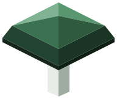
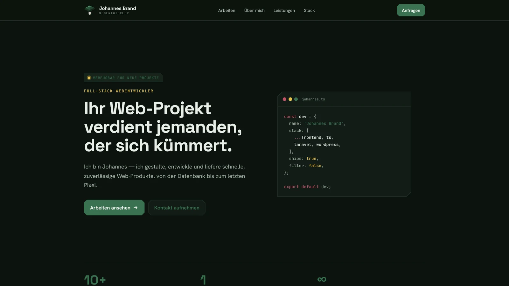

<div align="center">

<picture>
  <source media="(prefers-color-scheme: dark)" srcset="public/mark-forest-dark.svg">
  
</picture>

# Laccaria

**Personal homepage & portfolio of [Johannes Brand](https://laccaria.de) — freelance web developer.**

Bilingual (🇩🇪 German / 🇬🇧 English) · Next.js 16 · React 19 · Tailwind CSS v4 · MDX case studies

[laccaria.de](https://laccaria.de) · [Projects](https://laccaria.de/projects) · [Contact](https://laccaria.de/contact)



</div>

---

## About

Laccaria is a small, content-light marketing site with a hand-rolled design system:

- **Landing page (`/`)** — a single rich page composed of sections: Hero, About, Services, Uses (tools & stack) and Featured Projects (Swiper slider).
- **Projects (`/projects`, `/projects/[slug]`)** — an index of selected work plus per-project case studies rendered from MDX.
- **Contact (`/contact`)** — contact form delivered via SMTP (Nodemailer, server action).
- **Legal** — `/imprint` (Impressum), `/privacy` (Datenschutz) and `/accessibility`.

The whole site ships in **German (default)** and **English** from one codebase, with full SEO plumbing: canonical URLs, hreflang alternates, sitemap, robots, JSON-LD structured data and pre-generated OpenGraph cards per project and locale.

## Tech stack

| Layer | Choice |
| --- | --- |
| Framework | [Next.js 16](https://nextjs.org) (App Router) + [React 19](https://react.dev) |
| Language | TypeScript (strict mode, no `any`) |
| Styling | [Tailwind CSS v4](https://tailwindcss.com) (`@tailwindcss/postcss`) |
| i18n | [next-intl](https://next-intl.dev) — `[locale]` segments, `as-needed` prefixing |
| Content | MDX via `next-mdx-remote` + `gray-matter` (one file per project per locale) |
| Sliders | [Swiper](https://swiperjs.com) |
| Mail | [Nodemailer](https://nodemailer.com) (contact form) |
| Dev shell | Nix flake providing Node 22 |

No CMS, no database — all content lives in the repo as MDX and translation JSON.

## Getting started

```bash
# optional: enter the Nix dev shell (provides Node 22)
nix develop

npm install
cp .env.example .env.local   # then fill in the SMTP credentials
npm run dev                  # → http://localhost:3099
```

The dev server serves German at `/` and English under `/en`.

### Scripts

| Command | What it does |
| --- | --- |
| `npm run dev` | Start the dev server on port **3099** |
| `npm run build` | Production build (runs `og` first via `prebuild`) |
| `npm run start` | Serve the production build |
| `npm run lint` | ESLint (flat config, `eslint .`) |
| `npm run og` | Pre-generate per-project OpenGraph cards (see below) |
| `npm run webp` | Convert project images to WebP |

### Environment variables

See [`.env.example`](.env.example) for the full annotated list:

- `NEXT_PUBLIC_SITE_URL` — canonical origin (no trailing slash); drives canonicals, hreflang, sitemap and OG image URLs.
- `SMTP_HOST` / `SMTP_PORT` / `SMTP_SECURE` / `SMTP_USER` / `SMTP_PASS` — mail transport for the contact form.
- `CONTACT_TO` / `CONTACT_FROM` — where submissions are delivered and the authenticated sender.

## Project structure

```
app/
  [locale]/                 # ALL routes live here; locale is "de" | "en"
    layout.tsx              # html lang, NextIntlClientProvider, header/footer
    page.tsx                # landing — composes components/sections/*
    contact/                # contact page + server action (Nodemailer)
    projects/               # index + [slug] detail (renders MDX)
    imprint/  privacy/      # legal pages
components/
  ui/                       # primitives: Button, Container, Section, LocaleSwitcher, …
  sections/                 # Hero, About, Services, Uses, FeaturedProjects, ContactCTA
  ProjectSlider.tsx         # Swiper showcase ("use client")
content/projects/           # <slug>.de.mdx + <slug>.en.mdx — one file per locale
i18n/                       # routing, request config, typed navigation helpers
messages/                   # de.json + en.json — identical key trees, always in sync
lib/                        # site config, SEO helpers, structured data, projects loader
scripts/generate-og.mjs     # renders the static OG cards
proxy.ts                    # next-intl locale routing (Next 16: middleware → proxy)
```

## Internationalisation

- Locale prefixing is **`as-needed`**: German (default) is served unprefixed (`/`, `/projects`), English under `/en`; `/de/*` 308-redirects to the unprefixed form.
- Route pathnames are identical across locales.
- Every user-facing string lives in `messages/de.json` **and** `messages/en.json` — the two files always share the exact same key tree.
- Internal links use the typed helpers from `i18n/navigation.ts` (never `next/link` directly), so the locale prefix is always handled correctly.

## Content & OpenGraph cards

Each portfolio project is a pair of MDX files (`content/projects/<slug>.de.mdx` / `.en.mdx`) with shared frontmatter: title, summary, stack, gradient, hero image, result metrics and more. See [`docs/adding-a-project.md`](docs/adding-a-project.md) for the workflow.

Per-project social cards are **pre-generated static PNGs**, not a runtime image route: `npm run og` renders `scripts/generate-og.mjs` → `public/projects/<slug>/og.<locale>.png` (title + stack + framed hero, straight from the frontmatter). The project detail pages reference them and fall back to the site-wide card (`public/laccaria-og.png`) when a file is missing. Re-run `npm run og` after changing a project's title, kind, summary, stack, gradient or hero.

## License

Personal project — © Johannes Brand, all rights reserved. The code is public for reference; the content, design and brand assets are not licensed for reuse.
